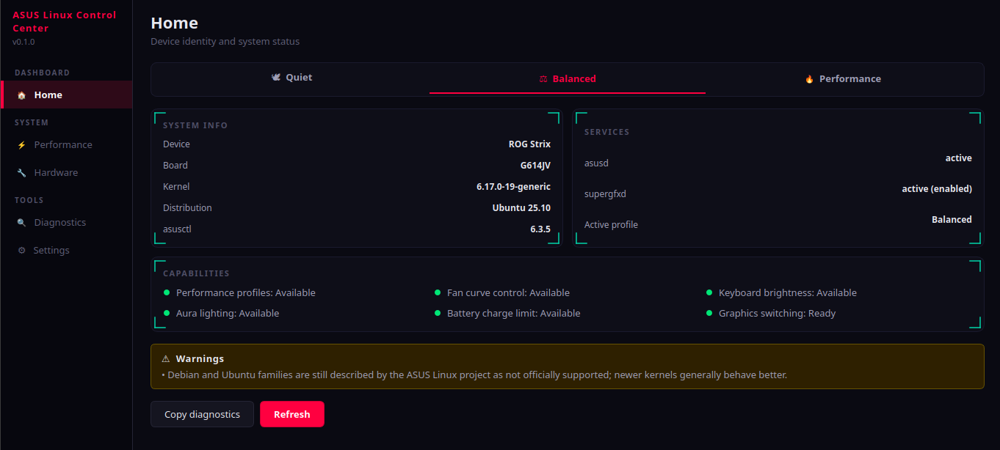
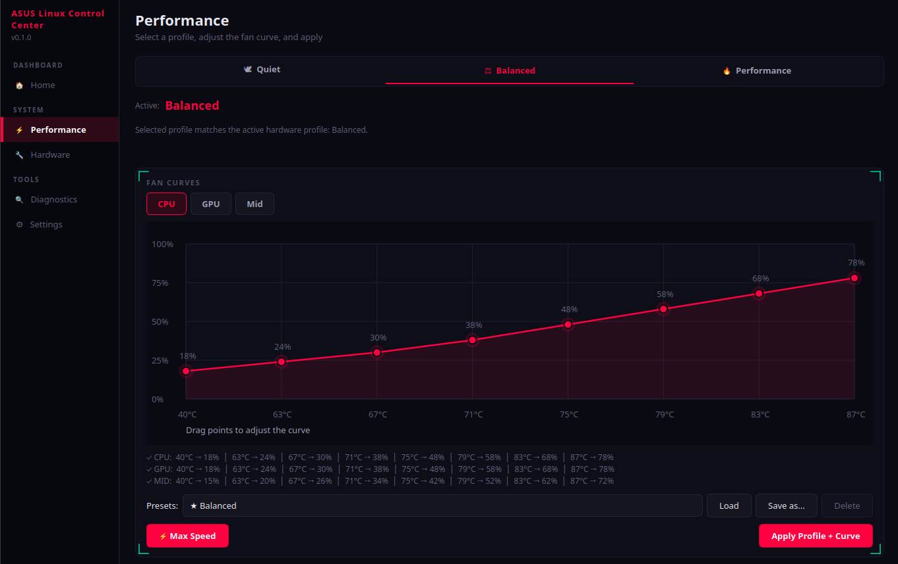
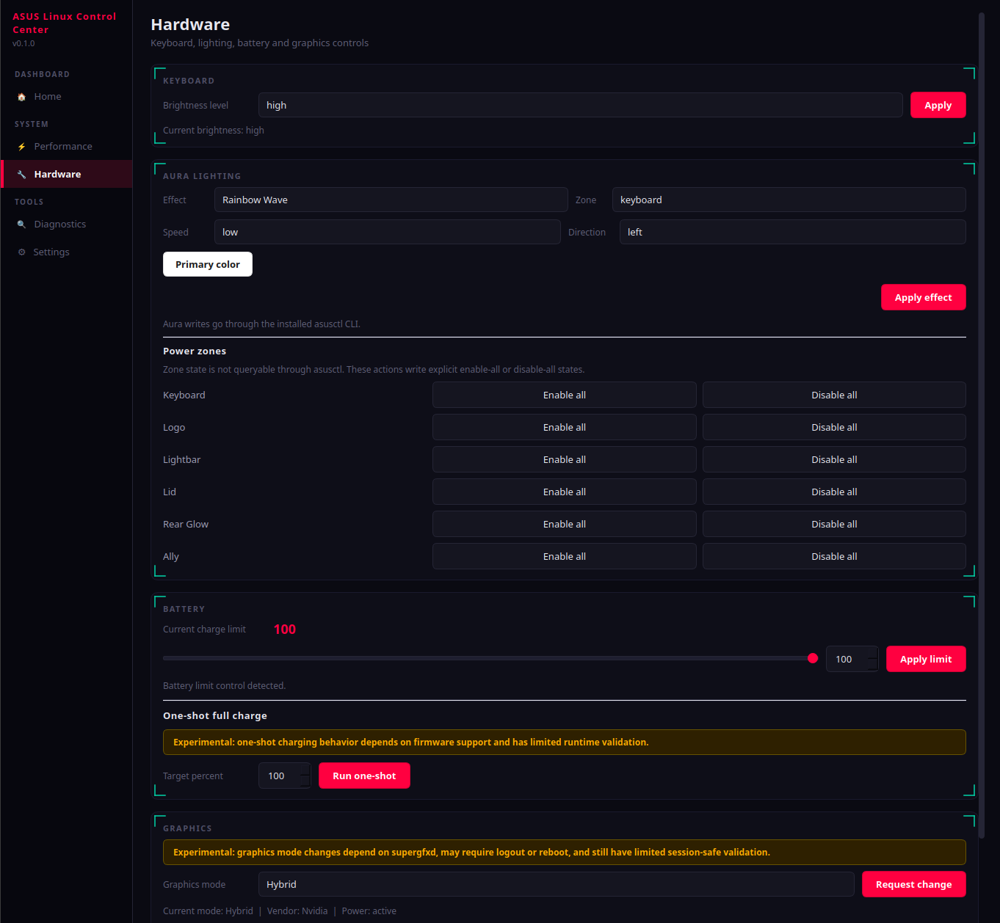

# ASUS Linux Control Center

[](https://github.com/OsamaAlhasanat/asusctl-control-center/releases)
[](https://github.com/OsamaAlhasanat/asusctl-control-center/actions/workflows/ci.yml)
[](LICENSE)
[](pyproject.toml)

ASUS Linux Control Center is a desktop GUI for the Linux ASUS stack.

It sits on top of `asusctl` with optional `supergfxctl` integration, detects what is actually available on the current machine, and only shows controls that the backend can support honestly.

It is designed for public release and general users, not for one specific laptop model or a single-device workflow. When the required ASUS Linux pieces are missing or incomplete, the app reports that clearly and exposes diagnostics instead of pretending every system supports the same controls.

## Why this exists

The ASUS Linux ecosystem already has the real backend tools. What many users still need is a clean desktop frontend that:

- exposes the supported controls without making false promises
- makes `asusctl` and optional `supergfxctl` easier to use day to day
- helps users on Ubuntu and other non-Arch setups understand what is missing
- generates diagnostics that are actually useful when something does not work

## Highlights

- capability-aware dashboard for device, service, and backend status
- performance profile switching with fan curve editing on supported hardware
- keyboard, Aura, battery, and graphics controls in one desktop UI
- built-in diagnostics export for bug reports and setup troubleshooting
- public release artifacts, automated tests, and validation notes in-repo

## Screenshots

### Home



Device identity, backend services, supported capabilities, active profile, and setup warnings are visible in one place.

### Performance



ASUS profile switching and fan curve editing stay together so supported laptops can tune performance without dropping to the CLI.

### Hardware



Keyboard brightness, Aura lighting, battery limits, one-shot charging, and optional graphics controls are grouped into one hardware page.

## What users see in the app

- `Home`: device identity, active services, supported capabilities, and warnings
- `Performance`: ASUS profile switching plus fan curve editing where the backend supports it
- `Hardware`: keyboard brightness, Aura controls, battery limits, and optional graphics mode actions
- `Diagnostics`: copyable and exportable system reports for troubleshooting
- `Settings`: runtime paths, theme selection, and project support links

## What this app is

- a PyQt desktop frontend for `asusctl`
- an optional frontend for `supergfxctl` graphics mode switching
- a capability-aware UI that only exposes supported controls
- a diagnostics tool that helps users file actionable bug reports

## Project position

This project does not replace `asusd`, `asusctl`, or `supergfxctl`.

It differentiates itself by focusing on:

- explicit capability detection
- clear unsupported states instead of fake controls
- a standalone contributor-friendly Python/Qt codebase
- Ubuntu and cross-distro guidance for users who are not already inside the asus-linux package ecosystem
- diagnostics that make issue reports actionable

The backend remains the upstream Linux ASUS stack:

- `asusctl` and `asusd` for performance profiles, fan curves, battery limits, keyboard brightness, and Aura lighting
- `supergfxctl` and `supergfxd` only when graphics mode switching is actually needed
- read-only low-level ASUS kernel attributes for troubleshooting

## Current scope

Implemented in this rebuild:

- device and service overview
- ASUS profile detection and switching
- fan curve detection and editing on supported devices
- keyboard brightness control
- Aura effect presets and Aura power zone actions
- battery charge limit and one-shot charge actions
- optional `supergfxctl` graphics mode switching
- diagnostics report export/copy
- settings persistence for window state, editor state, and lighting selections

Intentionally not shipped in v0.1.0:

- AniMe Matrix editing UI
- Slash / SCSI LED UI
- direct low-level firmware attribute writes
- packaging for every distro

Those areas are highly model-specific and need more hardware validation before they can be exposed responsibly.

## Project status

- Public `v0.1.0` release is available in [GitHub Releases](https://github.com/OsamaAlhasanat/asusctl-control-center/releases)
- Source distributions and wheel artifacts are published for the release
- Automated tests, linting, and build steps are part of the repository workflow
- Hardware validation notes and current support boundaries are documented openly

## Optional npm wrapper

The repository now includes a thin npm wrapper in [`npm-wrapper/`](npm-wrapper).

It is designed for users and integrators who want a Node-facing launcher without rewriting the app in JavaScript:

- prefers a system `asus-linux-control-center` if one already exists
- can bootstrap a managed Python virtualenv fallback
- exposes `doctor`, `diagnostics`, `install-core`, and `run` commands
- keeps hardware logic and diagnostics inside the Python core

See [docs/NPM_WRAPPER.md](docs/NPM_WRAPPER.md) for the architecture and release-coupling details.

## Support model

The app does not claim universal ASUS support.

- Most functionality depends on `asusctl`, `asusd`, kernel support, and model-specific firmware exposure.
- Fan curves are only shown when the current device actually exposes them.
- Aura controls are only shown when the backend reports usable Aura commands.
- Graphics mode switching is optional and only available when `supergfxctl` is installed.
- A working `supergfxctl` setup also requires `supergfxd`, its systemd unit, and the system D-Bus policy. A user-local binary alone is not enough.
- Low-level ASUS firmware attributes are shown read-only for troubleshooting when the kernel exposes them.

See [docs/SUPPORT.md](docs/SUPPORT.md) for the detailed support boundaries and research basis.

## Install and run

### Requirements

- Linux with systemd
- Python 3.11 or newer
- `asusctl` and `asusd` for ASUS hardware control
- optional: `supergfxctl` and `supergfxd` for graphics mode switching

### Step 1. Install the ASUS backend

The upstream ASUS Linux project still describes Debian and Ubuntu families as not officially supported. That does not mean the stack never works there; it means support quality depends heavily on kernel age, packaging, and machine model.

Install the backend in this order:

1. Install or build `asusctl` and `asusd` first.
2. Only install `supergfxctl` if you actually need graphics mode switching.

If you do install `supergfxctl`, treat it as a system integration rather than a standalone CLI drop-in. A usable setup depends on `supergfxd`, the system service, and the system D-Bus policy being installed correctly.

### Step 2. Verify the backend

Run:

```bash
asusctl info
systemctl is-active asusd.service
```

Expected result:

- `asusctl info` should print device information instead of failing.
- `systemctl is-active asusd.service` should return `active`.

If you installed `supergfxctl`, also make sure `supergfxd` is installed and running as a system service.

### Step 3. Install the app

Standard install:

```bash
python3 -m pip install .
```

User-local install with desktop entry and icon:

```bash
./scripts/install-user.sh
```

### Step 4. Run the app

```bash
asus-linux-control-center
```

### Step 5. Collect diagnostics when needed

If the UI opens but some controls are disabled, collect diagnostics before filing a bug.

Text report:

```bash
asus-linux-control-center --diagnostics
```

JSON report:

```bash
asus-linux-control-center --diagnostics-json
```

See [docs/TROUBLESHOOTING.md](docs/TROUBLESHOOTING.md) for common setup problems.

## Development

Create a virtualenv that can reuse the system PyQt6 installation if present:

```bash
python3 -m venv --system-site-packages .venv
.venv/bin/python -m pip install -U pip
.venv/bin/python -m pip install -e .[dev]
```

If `python3 -m venv` fails because `ensurepip` is unavailable, install your distro's `python3-venv` package or bootstrap `pip` into the venv manually before running the remaining commands.

Useful commands:

```bash
make test
make lint
make diagnostics
make build
```

## Documentation

- [docs/ARCHITECTURE.md](docs/ARCHITECTURE.md)
- [docs/NPM_WRAPPER.md](docs/NPM_WRAPPER.md)
- [docs/PUBLISHING.md](docs/PUBLISHING.md)
- [docs/SUPPORT.md](docs/SUPPORT.md)
- [docs/TROUBLESHOOTING.md](docs/TROUBLESHOOTING.md)
- [docs/VALIDATION.md](docs/VALIDATION.md)

## License

GPL-3.0-or-later. See [LICENSE](LICENSE).

## Trademark notice

ASUS and ROG are trademarks of ASUSTeK Computer Inc. This project is an independent open-source utility and is not affiliated with or endorsed by ASUS.
